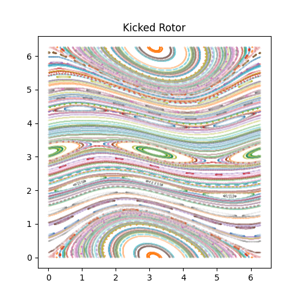

# Kicked Rotor

This is a code to generate Kicked Rotor and predict the chaotic factor for the standard map.

This is a 1D rotor, periodically kicked with a position-dependent amplitude.The Hamiltonian is given by:

$\begin{align}
H 
&= {p^2\over 2I} + k \cos(\theta)\sum_{n=-\infty}^\infty \delta(t-n\tau)
\end{align}$

It could be understood as a particle moving into a ring receiving some kicks eventualy in its direction. We can analyze the system by a stroboscopic point of view, building a Poincaré map by picturing the evolution once every period. The standard map can give the relation between the coordinates in phase space before the n'th kick and just before the (n+1)'th kick.

$
\begin{align}
p_{n+1} 
&= 
p_n + k\sin\theta_{n}
\\
\theta_{n+1} 
&=
\theta_n + {T\over I} p_{n+1}
\end{align} $

or, alternatively,

$
\begin{align}
\theta_{n+1} 
&=
\theta_n + {T\over I} p_n
\\
p_{n+1} 
&= 
p_n + k\sin\theta_{n+1}
\end{align}
$

https://en.wikipedia.org/wiki/Kicked_rotator

http://www.scholarpedia.org/article/Chirikov_standard_map

https://boulderschool.yale.edu/sites/default/files/files/Delande-kicked_rotor_lectures_1_and_2.pdf

The K factor gives us the strenght of the kick, and it also gives the degree of chaos of our system.
There are two codes here, on to generate the data, images of .npz of the coordinates of the system,
and a PyTorch regression CNN to discover the k factor only with the standard map image.
It's a toy model to exercise PyTorch, the networks predicts the K factor to the third second decimal place.
The result seems good. The thing is, this model is chaotic, so, probably there is a limit on how well the network can perform because,
by definition, it is not predictible, it is chaotic. 